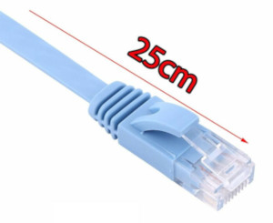
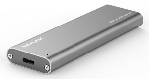
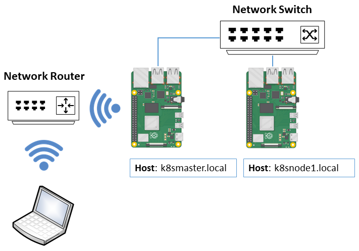
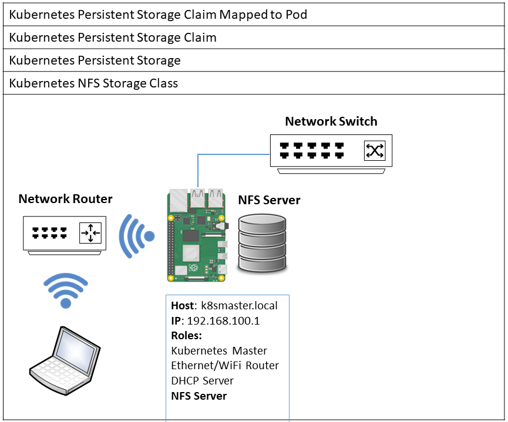

# Part 1: Raspberry Pi Kubernetes Cluster - Intelligence on the Edge

|Author|[Dave Glover, Microsoft Australia](https://developer.microsoft.com/en-us/advocates/dave-glover)|
|----|---|
|Platform| Raspberry Pi, Raspbian Buster, Kernel 4.19|
|Date|October 2019|
| Acknowledgements | Inspired by [Alex Ellis' work with his Raspberry Pi Zero Docker Cluster](https://blog.alexellis.io/visiting-pimoroni/) |

## Raspberry Pi Kubernetes Cluster


## Introduction

This project forms part of a three part **Intelligence on the Edge** series. The following topics will follow:

* Part 2: Bringing Python and .NET Azure Functions and Machine Learning models to the Edge. Including Pod placement and working with hardware.  
* Part 3: Deploying and managing Intelligence on the Edge with Azure IoT Edge.

## Parts List

|Items||
|-----|----|
| 1 x Raspberry Pi for Kubernetes Master. I used a Raspberry 3B Plus.<br/><br/>2 x Raspberry Pis for Kubernetes Nodes: I used two Raspberry Pi 4 4GBs.<br/><br/>3 x SD Cards (min 16GB, recommend 32GB, but can be smaller if you intend to run the Kubernetes Nodes from USB3 SSD.<br/><br/>3 Power supplies, one for each Raspberry Pi.| |
|1 x Network Switch [Dlink DGS-1005A](https://www.dlink.com.au/home-solutions/DGS-1005A-5-port-gigabit-desktop-switch) or similar|  |
|Optional: 1 x [Raspberry Pi Rack](https://www.amazon.com.au/gp/product/B013SSA3HA/ref=ppx_yo_dt_b_asin_title_o02_s00?ie=UTF8&psc=1) or similar |  |
|Optional: 2 x [Pimoroni Blinkt](https://shop.pimoroni.com/products/blinkt) RGB Led Strips. The BlinkT LED Strip can be a great way to visualize pod state. | .|
|Optional: 3 x 25 CM Ethernet Patch Cables | |
|Optional: 2 x USB3 SSDs for Kubernetes Nodes, or similar, ie something small. Installation script sets up Raspberry Pi Boot from USB3 SSD. Note, these are [SSD Enclosures](https://www.amazon.com.au/Wavlink-10Gbps-Enclosure-Aluminum-Include/dp/B07D54JH16/ref=sr_1_8?keywords=usb+3+ssd&qid=1571218898&s=electronics&sr=1-8), you need the M.2 drives as well.|  |

## Creating Raspberry Pi Boot SD Cards

1. Using [balena Etcher](https://www.balena.io/etcher/), flash 3 x SD Cards with [Raspbian Buster Lite](https://www.raspberrypi.org/downloads/raspbian/)
2. On **ONE** SD Card, add the a **wpa_supplicant.conf** file with your WiFi Routers WiFi settings. This card with be used for the Kuberetes Master.

    ```text
    ctrl_interface=DIR=/var/run/wpa_supplicant GROUP=netdev
    update_config=1
    country=AU

    network={
        ssid="SSID"
        psk="WiFi Password"
    }
    ```

3. On **ALL** SD Cards add an empty file named **ssh**. This enabled SSH for the Raspberry Pi when it boots up.

## Kubernetes Network Topology

The Kubernetes Master is also responsible for:

1. Allocating IP Addresses to the Kubernetes Nodes.
2. Bridging network traffic between the external WiFi network and the internal cluster Ethernet network.


## Naming Conventions

1. Kubernetes Master: k8smaster.local
2. Kubernetes Nodes: k8snode1..n

## Kubernetes Master Installation


SSH to what will you will become the Kubernetes Master and run the following command:

```bash
bash -c "$(curl https://raw.githubusercontent.com/gloveboxes/Raspberry-Pi-Kubernetes-Cluster/master/setup.sh)"
```

The installation **setup.sh** bash script will first install **git** on the Raspberry Pi, this git repository will then cloned to the device, and then you will be prompted to install the Kubernetes Master or Node. Select **Master**

The installation will performance the following operations:

1. The Raspberry Pi will be renamed to **k8smaster**
2. Various optimizations/prerequisites set (tmpfs, GPU memory, 64bit kernel enabled, swap diabled, cgroups for k8s, iptables set to legacy mode)
3. Network settings configured (Static address for eth0, and packet routing defined)
4. DHCP Server and Docker installed
5. The Raspberry pi will reboot after Docker installation
6. Reconnect as **ssh pi@k8smaster.local**
7. The installation will restart
8. Kubernetes will be installed
9. [Flannel CNI](https://kubernetes.io/docs/concepts/cluster-administration/networking/#the-kubernetes-network-model) (Cluster Networking) installation
10. [MetalLB LoadBalance](https://metallb.universe.tf/) installation
11. Kubernetes Dashboard installation and configuration for admin access

## Kubernetes Node Set Up

Ensure the k8smaster and the Raspberry Pi that will be the first Kubernetes node are powered on and connected to the Network Switch. The DHCP Server running on the k8smaster will allocate an IP Address to the Raspberry Pi that will be the Kubernetes node.



1. Reconnect to the k8smaster **ssh pi@k8smaster.local**
2. From the k8smaster device **ssh pi@raspberry.local**
3. Run the following command from the SSH terminal:

    ```bash
    bash -c "$(curl https://raw.githubusercontent.com/gloveboxes/Raspberry-Pi-Kubernetes-Cluster/master/setup.sh)"
    ```

## Static Route to the Kubernetes Cluster Subnet

1. The Kubernetes Cluster runs isolated on the **Network Switch** and operates on subnet 192.168.100.0/24.
2. A static route needs to be configured either on the **Network Router** (or on your computer) to define the entry point (gateway) into the Cluster subnet (192.168.100.0/24).
3. The gateway into the cluster is the IP Address of the WiFi adapter on the Kubernetes Master Raspberry Pi. In the following diagram the gateway into the cluster is the address allocated by the **Network Router** to the Kubernetes Master WiFi adapter which is 192.168.0.55.

Most **Network Routers** allow you to configure a static router. The following is an example configured on a Linksys Router.


### Alternative: Set Local Static Route to Cluster Subnet (192.168.100.0/24)

If you don't have access to configure the Network Router you can set a static route on your local computer.

### Windows

From "Run as Administrator" Command Prompt

```bash
route add 192.168.100.0 mask 255.255.255.0 192.168.0.55
```

### macOS and Linux

**NOT WORKING RESEARCH SOME MORE**

```bash
route add -net 192.168.100.0 netmask 255.255.255.0 gw 192.168.0.55
```

## Installing kubectl on your Desktop Computer

1. [Install and Set Up kubectl](https://kubernetes.io/docs/tasks/tools/install-kubectl/)
2. Open a terminal window on your desktop computer
3. Change directory to your home directory
    * macOS, Linux, and Windows Powershell `cd ~/`, Windows Command Prompt `cd %USERPROFILE%`
4. Copy Kube Config from **k8smaster.local**

    ```bash
    scp -r pi@k8smaster.local:~/.kube .kube
    ```

## Kubernetes Dashboard

Acknowledgements:

* [Creating admin user to access Kubernetes dashboard](https://medium.com/@kanrangsan/creating-admin-user-to-access-kubernetes-dashboard-723d6c9764e4)

1. From the Kubernetes Master (ssh pi@k8smater.local), create a Dashboard access token

    ```bash
    kubectl -n kube-system describe secret $(kubectl -n kube-system get secret | grep admin-user | awk '{print $1}')
    ```

On Desktop computer start the Kubernetes Proxy

```bash
kubectl proxy
```

From your web browser, link to:

**http://localhost:8001/api/v1/namespaces/kubernetes-dashboard/services/https:kubernetes-dashboard:/proxy/#/overview?namespace=default** 


## Kubernetes Cluster Persistence Storage

NFS Server installed on k8snode1.local

1. Set up by Kubernetes Master and k8snode1.local installation.
2. Further description coming

* [Kubernetes NFS-Client Provisioner](https://github.com/kubernetes-incubator/external-storage/tree/master/nfs-client)
* [kubernetes-incubator/external-storage](https://github.com/kubernetes-incubator/external-storage/blob/master/nfs-client/deploy/deployment-arm.yaml)

See yaml definitions for more details

* ./kubeset/persistent-volume-claim.yaml
* ./kubeset/persistent-volume.yaml
* ./kubeset/nfs-client-deployment-arm.yaml

