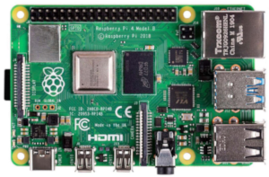
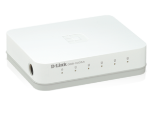
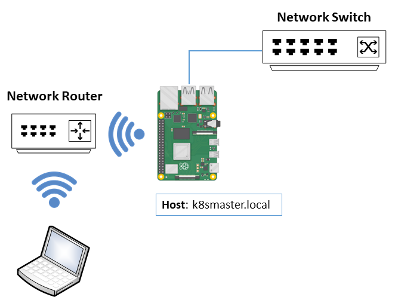

# Part 1: Raspberry Pi Kubernetes Cluster - Intelligence on the Edge

|Author|[Dave Glover, Microsoft Australia](https://developer.microsoft.com/en-us/advocates/dave-glover)|
|----|---|
|Platform| Raspberry Pi, Raspbian Buster, Kernel 4.19|
|Date|October 2019|
| Acknowledgements | Inspired by [Alex Ellis' work with his Raspberry Pi Zero Docker Cluster](https://blog.alexellis.io/visiting-pimoroni/) |

## Raspberry Pi Kubernetes Cluster


## Introduction

<!-- Great way to learn Kubernetes
Services installed
Flannel CNI
MetalLb LoadBalancer
Kubernetes Dashboard -->

This project forms part of a three part **Intelligence on the Edge** series. The following topics will follow:

* Part 2: Bringing Python and .NET [Azure Functions](https://azure.microsoft.com/en-au/services/functions?WT.mc_id=github-blog-dglover) and Machine Learning models to the Edge. Including Pod placement and working with hardware.  
* Part 3: Deploying and managing Intelligence on the Edge with [Azure IoT Edge](https://azure.microsoft.com/en-au/services/iot-edge?WT.mc_id=github-blog-dglover).

## Parts List

|Items||
|-----|----|
| 1 x Raspberry Pi for Kubernetes Master. I used a Raspberry 3B Plus.<br/><br/>2 x Raspberry Pis for Kubernetes Nodes: I used two Raspberry Pi 4 4GBs. <br/><br/>Note, Raspberry Pi 4s make great Kubernetes Nodes, but Raspberry Pi 3s and 2s will work well too.<br/><br/>3 x SD Cards (min 16GB, recommend 32GB, but can be smaller if you intend to run the Kubernetes Nodes from USB3 SSD.<br/><br/>3 Power supplies, one for each Raspberry Pi.| |
|1 x Network Switch [Dlink DGS-1005A](https://www.dlink.com.au/home-solutions/DGS-1005A-5-port-gigabit-desktop-switch) or similar|  |
|3 x Ethernet Patch Cables (I used 25cm patch cables to reduce clutter.) | |
|Optional: 1 x [Raspberry Pi Rack](https://www.amazon.com.au/gp/product/B013SSA3HA/ref=ppx_yo_dt_b_asin_title_o02_s00?ie=UTF8&psc=1) or similar |  |
|Optional: 2 x [Pimoroni Blinkt](https://shop.pimoroni.com/products/blinkt) RGB Led Strips. The BlinkT LED Strip can be a great way to visualize pod state. | .|
|Optional: 2 x USB3 SSDs for Kubernetes Nodes, or similar, ie something small. Installation script sets up Raspberry Pi Boot from USB3 SSD. Note, these are [SSD Enclosures](https://www.amazon.com.au/Wavlink-10Gbps-Enclosure-Aluminum-Include/dp/B07D54JH16/ref=sr_1_8?keywords=usb+3+ssd&qid=1571218898&s=electronics&sr=1-8), you need the M.2 drives as well.|  |

## Creating Raspberry Pi Boot SD Cards

1. Using [balena Etcher](https://www.balena.io/etcher/), flash 3 x SD Cards with [Raspbian Buster Lite](https://www.raspberrypi.org/downloads/raspbian/)
2. On **one** SD Card, add the a **wpa_supplicant.conf** file with your WiFi Routers WiFi settings. This card with be used for the Kuberetes Master.

    ```text
    ctrl_interface=DIR=/var/run/wpa_supplicant GROUP=netdev
    update_config=1
    country=AU

    network={
        ssid="SSID"
        psk="WiFi Password"
    }
    ```

3. On **all** SD Cards add an empty file named **ssh**. This enables SSH for the Raspberry Pi when it boots up.

## Kubernetes Network Topology

The Kubernetes Master is also responsible for:

1. Allocating IP Addresses to the Kubernetes Nodes.
2. Bridging network traffic between the external WiFi network and the internal cluster Ethernet network.


## Naming Conventions

1. Kubernetes Master: k8smaster.local
2. Kubernetes Nodes: k8snode1..n

## Kubernetes Master Installation



### Installation Process

Ensure the Raspberry Pi to be configured as a Kubernetes Master is:

1. Connected by **Ethernet** to the **Network Switch**, and the **Network Switch** is power on.
2. The **WiFi Router** is in range and powered on.

#### Step 1: Connect to the Raspberry Pi to be Configured as the Kubernetes Master

1. From your desktop computer, start a SSH Session to the Raspberry Pi. `ssh pi@raspberrypi.local`.

#### Step 2: Start the Installation Process

1. Run the following command from the SSH terminal you started in step 1.

```bash
bash -c "$(curl https://raw.githubusercontent.com/gloveboxes/Raspberry-Pi-Kubernetes-Cluster/master/setup.sh)"
```

2. Select **M**aster set up.

#### Step 2: Prerequisites and Optimizations

No user action required.

1. The Raspberry Pi will be renamed to **k8smaster**
2. Various optimizations/prerequisites set (tmpfs, GPU memory, 64bit kernel enabled, swap diabled, cgroups for k8s, iptables set to legacy mode)
3. Network settings configured (Static address for eth0, and packet routing defined)
4. DHCP Server and Docker installed

#### Step 3: Docker Installation

No user action required.

1. Docker is installed and the Raspberry Pi will reboot.

#### Step 4: Kubernetes Installation

1. Reconnect to the Raspberry Pi as `ssh pi@k8smaster.local`
2. The installation will restart
3. Kubernetes will be installed

#### Step 5: Kubernetes Master Configuraton

No user action required.

1. [Flannel CNI](https://kubernetes.io/docs/concepts/cluster-administration/networking/#the-kubernetes-network-model) (Cluster Networking) installation
2. [MetalLB LoadBalance](https://metallb.universe.tf/) installation
3. Kubernetes Dashboard installation and configuration for admin access

#### Step 6: Record Kubernetes Node Join Token

1. You need to take a note, and save the **kubeadm join 192.168.100.1:6443 --token ... --discovery-token-ca-cert-hash ...** command. This will be displayed on the terminal screen. You will need this information to join the Kubernetes Nodes to the Kubernetes Master.

## Kubernetes Node Installation

Ensure the k8smaster and the Raspberry Pi that will be the first Kubernetes node are powered on and connected to the Network Switch. The DHCP Server running on the k8smaster will allocate an IP Address to the Raspberry Pi that will be the Kubernetes node.


### Installation Process

Ensure the Raspberry Pi to be configured as a Kubernetes Node is connected by **Ethernet** to same the **Network Switch** the Kubernetes Master is connected to.

Power on the Raspberry Pi, and IP Address will be allocated from the DHCP Server running in the Kubernetes Master you just configured.

Repeat for each Raspberry Pi that you intent to be Kubernetes Nodes.

#### Step 1: Connect to the Raspberry Pi to be Configured as a Node

1. From your desktop computer, start a SSH Session to the k8smaster. `ssh pi@k8smaster.local`.
2. From the SSH Session you just started to the k8smaster device start another session to Raspberry Pi to be configured as a Kubernetes Node. `ssh pi@raspberry.local`
3. Remove any existing known host reference to raspberrypi.local `ssh-keygen -f "/home/pi/.ssh/known_hosts" -R "raspberrypi.local"`

#### Step 2: Start the Installation Process

1. Run the following command from the SSH terminal you started in step 1.

```bash
bash -c "$(curl https://raw.githubusercontent.com/gloveboxes/Raspberry-Pi-Kubernetes-Cluster/master/setup.sh)"
```

2. Select **Node** set up.

#### Step 3: Number the Kubernetes Node

You will be prompted to number the Kubernetes Node. Ensure you have one node numbered **1** as NFS Server will be installed on Node **1** and is required for Kubernetes Persistent Storage.

#### Step 4: Enable Boot from SSD

Is you have USB3 attached SSD Storage then select this option. The installation script assumes the USB SSD Drive is located at **/dev/sda**. The scripts starts **fdisk**, you need to create a clean disk partition. Follow these steps:

1. p to display existing disk partition
2. d to delete existing partitions
3. n to create a new partition, create a new primary partition, and take the rest of the defaults.
4. w to write new partition table
5. **fdisk** will close and the SSD dive with be formated and the SD Root root drive copied and the **cmdline.txt** patched to boot from SSD.

This requires a reboot, log back in after the reboot and the installation will continue.

#### Step 5: Update the Raspberry Pi Operating System

Recommend yes. The Raspberry Pi will reboot on completion. Log back in after the reboot and the installation will continue.

#### Step 6: Install Pimoroni Fan SMIM Support

Recommend an active cooling system for the Raspberry Pi 4. I like the [Pimoroni Fan SMIM](https://shop.pimoroni.com/products/fan-shim) If you have one fitted to your Raspbeery Pi 4 then select **yes** to install.

#### Step 7: Perquisites are installed and configured

No user action required

#### Step 8: Docker Installation

No user action required. This requires a reboot, log back in after the reboot and the installation will continue.

#### Step 9: Kubernetes Installation

No user action required

#### Step 10: Join new node to the Kubernetes Cluster

When you created the Kubernetes Master the node join command is displayed. `**kubeadm join 192.168.100.1:6443 --token ... --discovery-token-ca-cert-hash ...**`. You need to run this command to join the node to the cluster.

```bash
sudo kubeadm join 192.168.100.1:6443 --token ... --discovery-token-ca-cert-hash ...
```

## Static Route to the Kubernetes Cluster Subnet

1. The Kubernetes Cluster runs isolated on the **Network Switch** and operates on subnet 192.168.100.0/24.
2. A static route needs to be configured either on the **Network Router** (or on your computer) to define the entry point (gateway) into the Cluster subnet (192.168.100.0/24).
3. The gateway into the cluster is the IP Address of the WiFi adapter on the Kubernetes Master Raspberry Pi. In the following diagram the gateway into the cluster is the address allocated by the **Network Router** to the Kubernetes Master WiFi adapter which is 192.168.0.55.

Most **Network Routers** allow you to configure a static router. The following is an example configured on a Linksys Router.


### Alternative: Set Local Static Route to Cluster Subnet (192.168.100.0/24)

If you don't have access to configure the Network Router you can set a static route on your local computer.

### Windows

From "Run as Administrator" Command Prompt

```bash
route add 192.168.100.0 mask 255.255.255.0 192.168.0.55
```

### macOS and Linux

**NOT WORKING RESEARCH SOME MORE**

```bash
route add -net 192.168.100.0 netmask 255.255.255.0 gw 192.168.0.55
```

## Installing kubectl on your Desktop Computer

1. [Install and Set Up kubectl](https://kubernetes.io/docs/tasks/tools/install-kubectl/)
2. Open a terminal window on your desktop computer
3. Change directory to your home directory
    * macOS, Linux, and Windows Powershell `cd ~/`, Windows Command Prompt `cd %USERPROFILE%`
4. Copy Kube Config from **k8smaster.local**

    ```bash
    scp -r pi@k8smaster.local:~/.kube .kube
    ```

## Kubernetes Dashboard

Acknowledgements:

* [Creating admin user to access Kubernetes dashboard](https://medium.com/@kanrangsan/creating-admin-user-to-access-kubernetes-dashboard-723d6c9764e4)

References:

* [Kubernetes Web UI (Dashboard)](https://kubernetes.io/docs/tasks/access-application-cluster/web-ui-dashboard/)

#### Step 1: Create Dashboard Access Token

This assumes you have installed **kubectl** and copied .kube config file to your desktop computer. 

```bash
kubectl -n kube-system describe secret $(kubectl -n kube-system get secret | grep admin-user | awk '{print $1}')
```

#### Step 2: Start the Kubernetes Proxy

On Desktop computer, in a terminal window start the Kubernetes Proxy

```bash
kubectl proxy
```

#### Step 3: Browse to the Kubernetes Dashboard

Click the following link to open the Kubernetes Dashboard. Select **Token** authentication, paste in the token you created from **Step 1** and connect.

**http://localhost:8001/api/v1/namespaces/kubernetes-dashboard/services/https:kubernetes-dashboard:/proxy/#/overview?namespace=default** 


## Kubernetes Cluster Persistence Storage

NFS Server installed on k8snode1.local

1. Set up by Kubernetes Master and k8snode1.local installation.
2. Further description coming

* [Kubernetes NFS-Client Provisioner](https://github.com/kubernetes-incubator/external-storage/tree/master/nfs-client)
* [kubernetes-incubator/external-storage](https://github.com/kubernetes-incubator/external-storage/blob/master/nfs-client/deploy/deployment-arm.yaml)

See yaml definitions for more details

* ./kubeset/persistent-volume-claim.yaml
* ./kubeset/persistent-volume.yaml
* ./kubeset/nfs-client-deployment-arm.yaml


## Useful Commands

### List DHCP Leases

```bash
dhcp-lease-list
```

### Regenerate Kubernetes Token

[kubeadm token](https://kubernetes.io/docs/reference/setup-tools/kubeadm/kubeadm-token/)

### Show Kubeadm Token

https://stackoverflow.com/questions/40009831/cant-find-kubeadm-token-after-initializing-master

```bash
cat /etc/kubernetes/pki/tokens.csv
```

kubeadm token list
kubeadm token create <copied token from previous command output>** --print-join-command

## Resetting Kubernetes Master or Node

````bash
sudo kubeadm reset && sudo systemctl daemon-reload && sudo systemctl restart kubelet.service
````